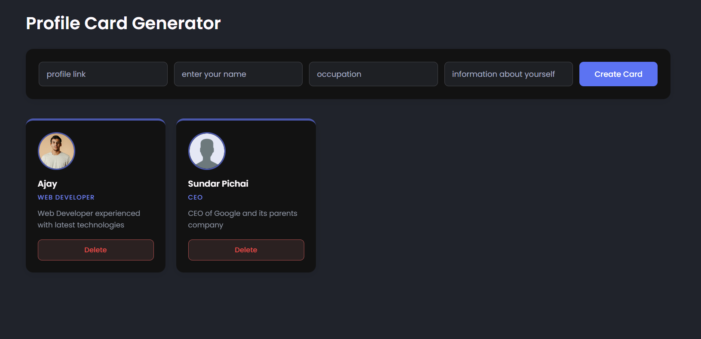

# Profile Card Generator

A simple JavaScript project that creates dynamic profile cards using form input.

## 🚀 Features

* Create profile cards using a form
* Dynamic DOM manipulation
* Delete individual cards
* Image fallback for broken links
* Basic form validation

## 🛠️ Technologies Used

* HTML
* CSS
* JavaScript

## 📚 What I Learned

* Handling form submit events
* DOM creation and manipulation
* Event listeners
* Basic UI styling

## ▶️ How to Run

1. Download or clone the repository
2. Open `index.html` in your browser

---
